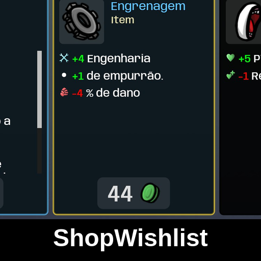

# ShopWishlist

Mark items in the shop and they get a colored border every time they show up - never skip past the item you are hunting while rerolling.

## Features

- Mark / unmark any item in the shop
- Colored border survives rerolls
- Lightweight, works with modded items

## Install

Download on [Steam Workshop](https://steamcommunity.com/sharedfiles/filedetails/?id=3771061737). Subscribe on the Steam Workshop - Brotato installs it automatically. Requires the Brotato ModLoader.

## Support

If this mod helped you: [donate via PayPal](https://www.paypal.com/donate/?business=SR28XBBCYSPHE&no_recurring=0&item_name=Help+me+buy+a+coffee.&currency_code=USD).
