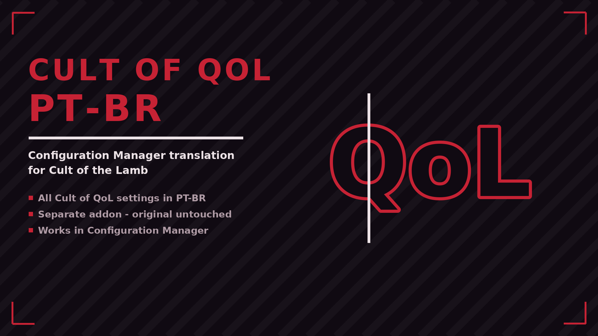

# Cult of QoL PT-BR

Traduz para português (BR) as opções do Cult of QoL Collection no Configuration Manager. Addon separado - não altera o mod original.

## Features

- All Cult of QoL settings in PT-BR
- Separate addon - original untouched
- Works in Configuration Manager

## Install

Download on [Nexus Mods](https://www.nexusmods.com/cultofthelamb/mods/84). Extract into the game folder - the DLL lands in `BepInEx/plugins/`. Requires BepInEx 5.

## Support

If this mod helped you: [donate via PayPal](https://www.paypal.com/donate/?business=SR28XBBCYSPHE&no_recurring=0&item_name=Help+me+buy+a+coffee.&currency_code=USD).
