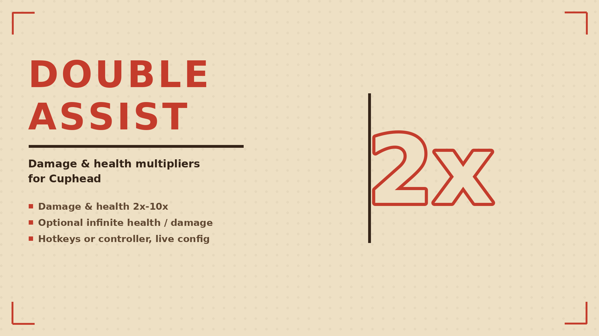

# Cuphead Double Assist

Multiplies your damage and health (2x-10x), with optional infinite health and damage. Toggle in-game with hotkeys or controller.

## Features

- Damage & health 2x-10x
- Optional infinite health / damage
- Hotkeys or controller, live config reload

## Translating

Texts live in `I18n.cs`, one dictionary per language keyed by the English string. To add a
language, copy the dictionary, translate the values and return it from `PickTable`.

## Install

Download on [Nexus Mods](https://www.nexusmods.com/cuphead/mods/115). Extract into the game folder - the DLL lands in `BepInEx/plugins/`. Requires BepInEx 5.

## Support

If this mod helped you: [donate via PayPal](https://www.paypal.com/donate/?business=SR28XBBCYSPHE&no_recurring=0&item_name=Help+me+buy+a+coffee.&currency_code=USD).
