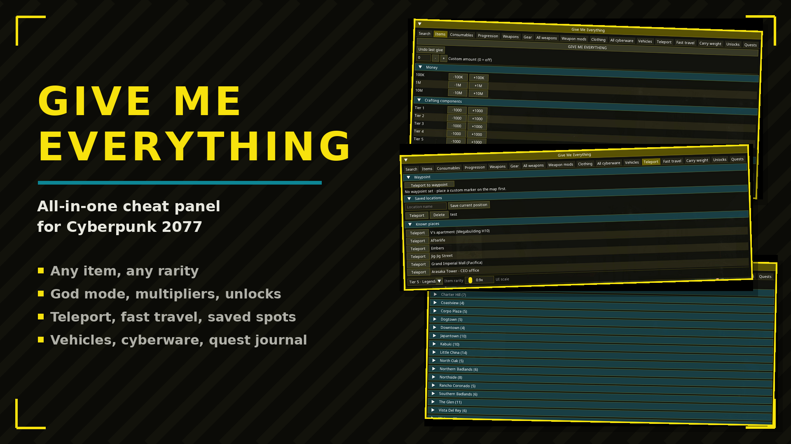

# GiveMeEverything

All-in-one cheat panel for CET: any item at any rarity, god mode, multipliers, teleport, fast travel, vehicles, quest journal and more.

## Features

- Any item, any rarity - 18 tabs
- Loot filter: block junk by category and tier
- God mode, XP/damage multipliers, unlocks
- Teleport, fast travel, saved locations
- Live quest journal with one-click track
- English & PT-BR

## Install

Download on [Nexus Mods](https://www.nexusmods.com/cyberpunk2077/mods/31460). Extract into the game root folder (the one with `bin`, `archive`, `r6`) or install with Vortex / Mod Organizer 2.

## Support

If this mod helped you: [donate via PayPal](https://www.paypal.com/donate/?business=SR28XBBCYSPHE&no_recurring=0&item_name=Help+me+buy+a+coffee.&currency_code=USD).
