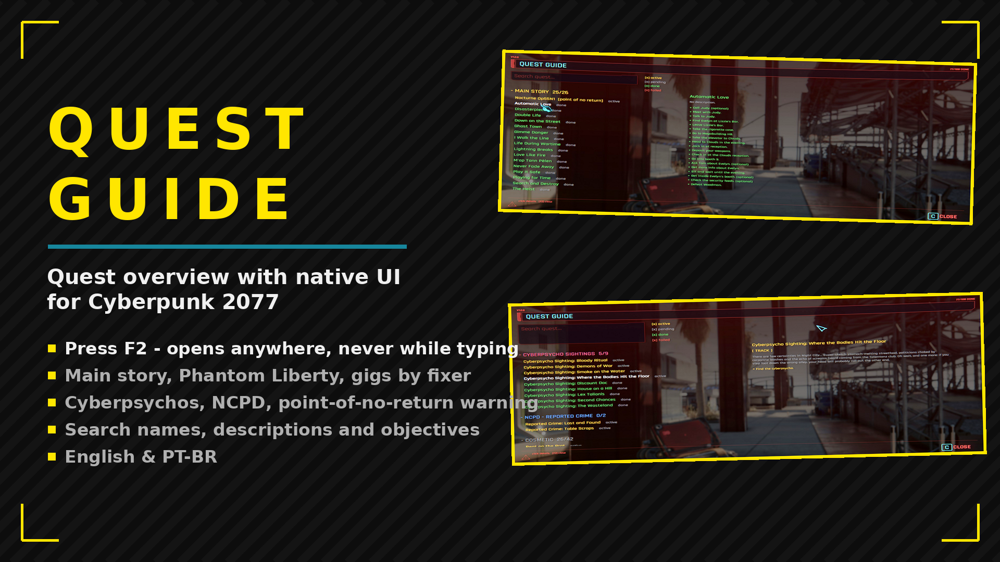

# QuestGuide

Press F2 for a native-UI quest guide: main story, Phantom Liberty, ending-affecting side jobs, gigs by fixer, cyberpsychos and NCPD, with live states, search and one-click tracking.

## Features

- Press F2 - full quest guide in-game (hotkey changeable in Mod Settings)
- Sections: main story, Phantom Liberty, affects-ending, gigs by fixer, cyberpsychos, NCPD, cosmetic
- Point-of-no-return warning; search covers descriptions and objectives
- Live states, filters, search, one-click track
- English & PT-BR, following the game language

## Translating

Texts live in `Localization.reds`. To add a language, copy a package class, translate the
strings and add a `case` in `GetPackage`. A translation can also ship as a separate mod:
register your own `ModLocalizationProvider` with the same keys.

## Install

Download on [Nexus Mods](https://www.nexusmods.com/cyberpunk2077/mods/31784). Extract into the game root folder (the one with `bin`, `archive`, `r6`) or install with Vortex / Mod Organizer 2.

## Support

If this mod helped you: [donate via PayPal](https://www.paypal.com/donate/?business=SR28XBBCYSPHE&no_recurring=0&item_name=Help+me+buy+a+coffee.&currency_code=USD).
