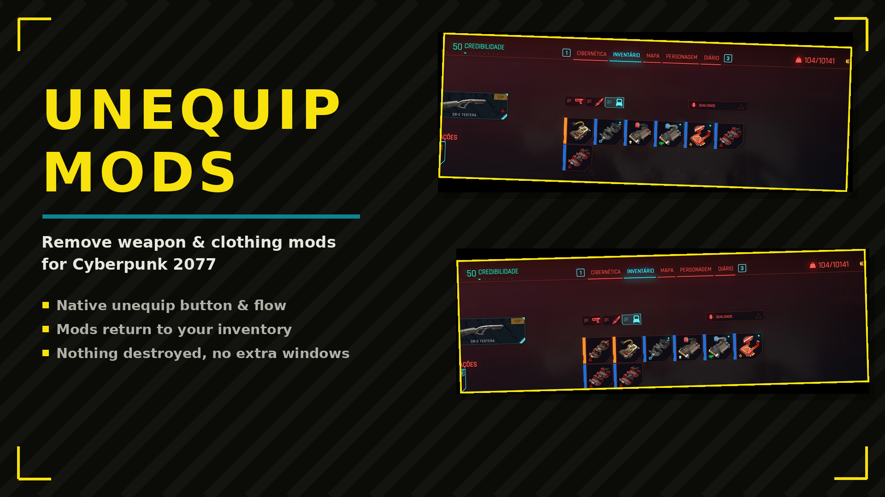

# UnequipMods

Unequip weapon and clothing mods back to your inventory instead of losing them. Native button and flow.

## Features

- Native unequip button & flow
- Mods return to your inventory
- Nothing destroyed, no extra windows

## Translating

Texts live in `Localization.reds`. To add a language, copy a package class, translate the
strings and add a `case` in `GetPackage`. A translation can also ship as a separate mod:
register your own `ModLocalizationProvider` with the same keys.

## Install

Download on [Nexus Mods](https://www.nexusmods.com/cyberpunk2077/mods/31701). Extract into the game root folder (the one with `bin`, `archive`, `r6`) or install with Vortex / Mod Organizer 2.

## Support

If this mod helped you: [donate via PayPal](https://www.paypal.com/donate/?business=SR28XBBCYSPHE&no_recurring=0&item_name=Help+me+buy+a+coffee.&currency_code=USD).
