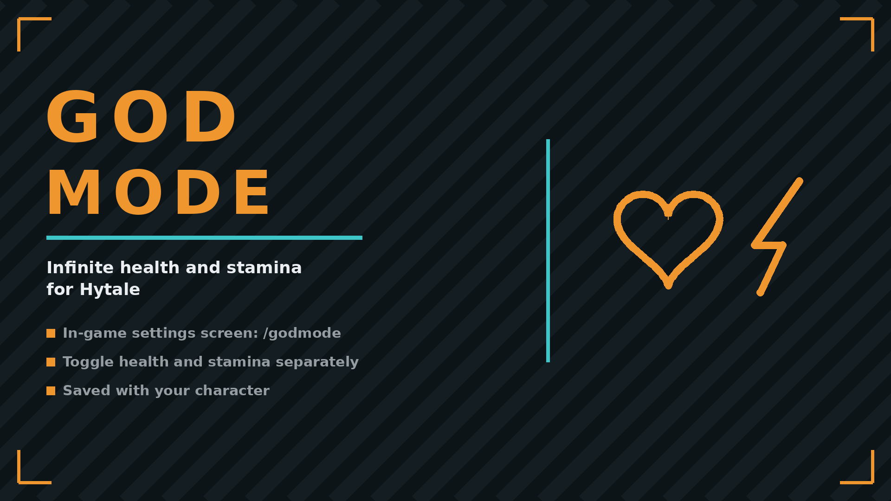

# GodMode

Hytale server plugin. Infinite health, stamina, oxygen, mana and signature energy with an in-game settings screen.

## ✨ Features
- `/godmode` opens a screen with separate toggles for health, stamina, oxygen, mana and signature energy
- `/godmode health|stamina|oxygen|mana|energy` quick-toggle without the screen
- Applies instantly, saves with your character
- No config files, no dependencies, nothing runs per tick

## 🌍 Translating
Texts live in `resources/Server/Languages/<locale>/server.lang`. To add a language, copy the
`en-US` folder, rename it to the locale and translate the values. Command descriptions stay in
English: the server has no translation hook for them.

## 📦 Install
Drop `GodMode-x.y.z.jar` into your Mods folder:
- Windows: `%AppData%\Hytale\UserData\Mods`
- Linux: `~/.local/share/Hytale/UserData/Mods`

Singleplayer works out of the box; on multiplayer servers only the server needs it.

## 🔗 Links
- Mod page: https://www.curseforge.com/hytale/mods/god-mode-menu
- All my mods: https://next.nexusmods.com/profile/opaaaaaaaaaaaa/mods
- Source & releases: https://github.com/nventatech/game-mods

## ☕ Support
If you like the mod: [PayPal](https://www.paypal.com/donate/?business=SR28XBBCYSPHE&no_recurring=0&item_name=Help+me+buy+a+coffee.&currency_code=USD)
