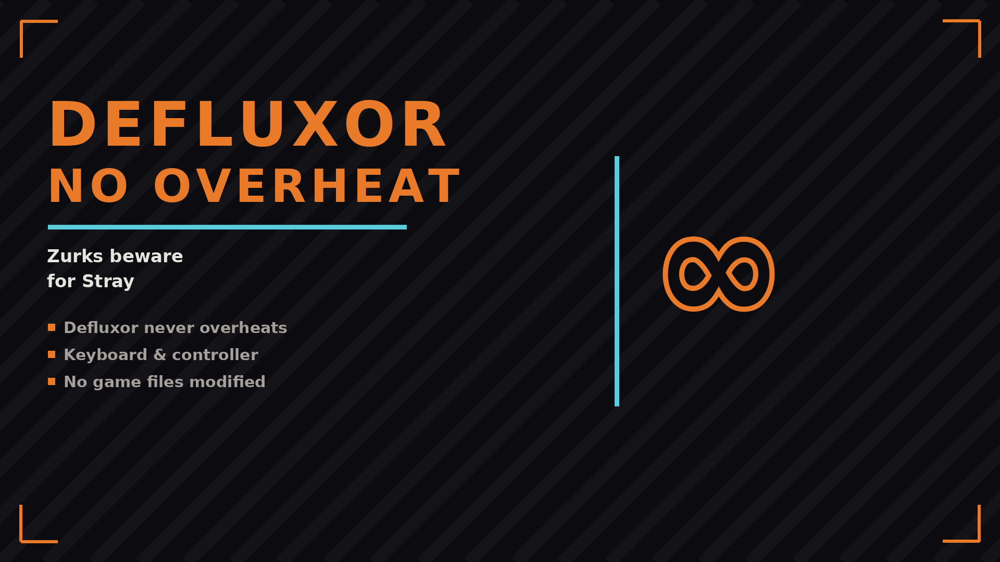

# Defluxor No Overheat

The Defluxor never overheats - keep it on as long as you want. Keyboard and controller, no game files modified.

## Features

- Defluxor never overheats
- Keyboard & controller
- No game files modified

## Install

Download on [Nexus Mods](https://www.nexusmods.com/stray/mods/390). Extract into the game folder - the DLL lands in `BepInEx/plugins/`. Requires BepInEx 5.

## Support

If this mod helped you: [donate via PayPal](https://www.paypal.com/donate/?business=SR28XBBCYSPHE&no_recurring=0&item_name=Help+me+buy+a+coffee.&currency_code=USD).
